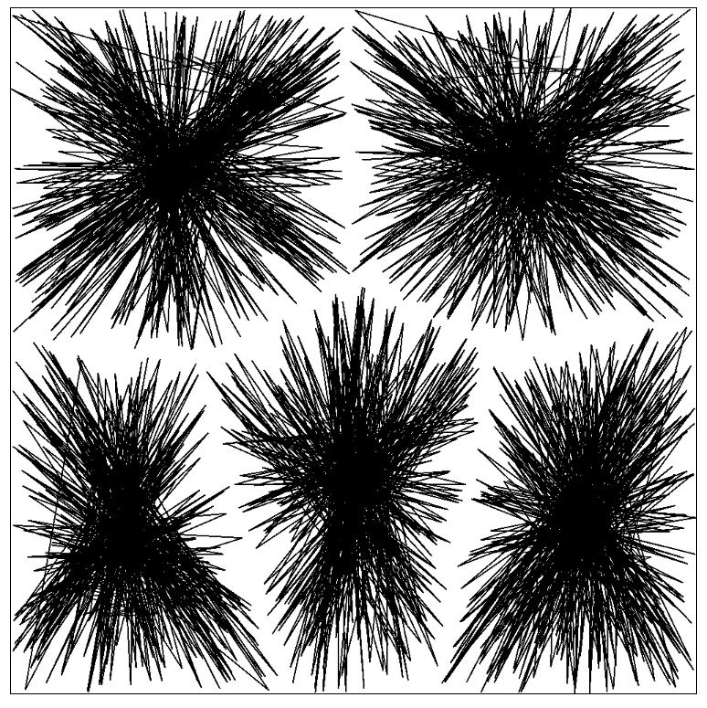

# Generative Art

Examples of the images:

## Links

- [Generative Machines with Matt DesLauriers](https://www.youtube.com/watch?v=8Uo6zFwSO78)
- [Tim Holman - Generative Art Speedrun](https://www.youtube.com/watch?v=4Se0_w0ISYk)
- [Patchwork "Algorithm" with example image](https://twitter.com/mattdesl/status/945728391902265345/photo/4)
- [Tutorials](https://generativeartistry.com/tutorials/)
- [Tutorial Github](https://github.com/tholman/tutorial-markdown)
- [Tom Holman Twitter](https://twitter.com/twholman)
- [Triangles on Canvas](https://www.educative.io/answers/how-to-draw-triangles-in-html-canvas)
- [Cluster Algorithm / Lib](https://github.com/NathanEpstein/clusters)
- [Distance between points](https://www.cuemath.com/geometry/distance-between-two-points/)
- [Kate Compton: Creating generative art with Javascript | JSConf Iceland 2018](https://www.youtube.com/watch?v=tJ49bTJ6fbs)