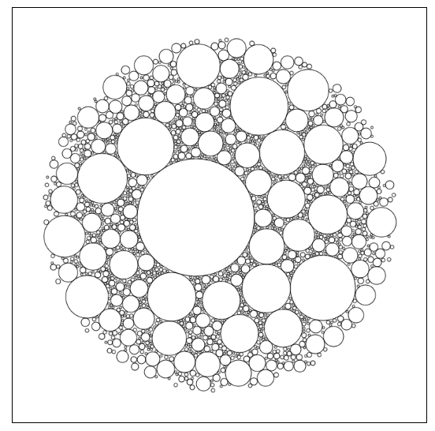

# Generative Art

It all started with a Reddit post in which someone posted his book on generative art. I sent this to a friend ([Jonathan Lange](https://github.com/langej)) and we decided to start a challenge until Sunday (today the 10.07.2022). Who manages to generate a cool picture until Sunday.

Thus I find to research. Found videos and contributions without end to the topic generative art. One of the best sites I found was [Tim Holman](https://generativeartistry.com/tutorials/). Here you can try everything and learn interactively how to create the images. One of my first attempts was the image:

I made it with the [tutorial](https://generativeartistry.com/tutorials/joy-division/) from Tim. And then it started to explore own things. Bringing my own variations into the pictures and designing my own. I played around a bit with triangles:

I also found it exciting to set points in circles:

But what took me the most time was the image:

It is based on the idea of the [tweet](https://twitter.com/mattdesl/status/945728391902265345/photo/4). I learned a lot about algorithms in 2D space. Also how to calculate if a point is in a surface, how straight lines work and how to vary the positions of points in space.

I can only recommend everyone to have a look at generative art and try something out. It's really fun and you can learn a lot about math and especially visualize it.

All code can be found on my [Github](https://github.com/auryn31/generative-art) as always. Here is the code in TypeScript and svelte to create your own images and modify existing ones.

## All Images

Examples of the images:

## Links

- [Generative Machines with Matt DesLauriers](https://www.youtube.com/watch?v=8Uo6zFwSO78)
- [Tim Holman - Generative Art Speedrun](https://www.youtube.com/watch?v=4Se0_w0ISYk)
- [Patchwork "Algorithm" with example image](https://twitter.com/mattdesl/status/945728391902265345/photo/4)
- [Tutorials](https://generativeartistry.com/tutorials/)
- [Tutorial Github](https://github.com/tholman/tutorial-markdown)
- [Tom Holman Twitter](https://twitter.com/twholman)
- [Triangles on Canvas](https://www.educative.io/answers/how-to-draw-triangles-in-html-canvas)
- [Cluster Algorithm / Lib](https://github.com/NathanEpstein/clusters)
- [Distance between points](https://www.cuemath.com/geometry/distance-between-two-points/)
- [Kate Compton: Creating generative art with Javascript | JSConf Iceland 2018](https://www.youtube.com/watch?v=tJ49bTJ6fbs)